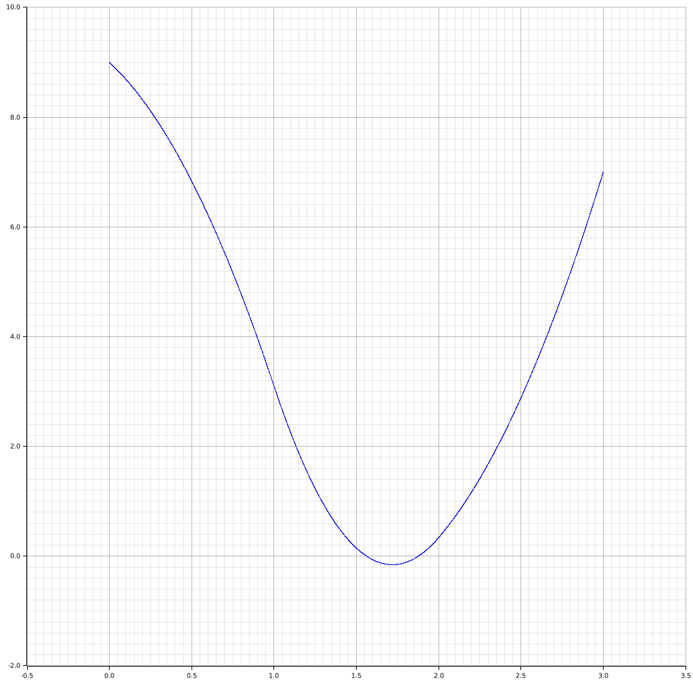

# Calulates Gravitational Potential problem with n finite elements. 

### run program
``` bash
./projekt -n 100
```

### build and run it freshly built
may need some additional dependencies
```
cargo run --release -- -n 100
```

### help
```
Usage: projekt [OPTIONS] --n <N>

Options:
  -n, --n <N>                number of elements
  -o, --out-path <OUT_PATH>  The path to the file to save output [default: output.png]
  -h, --help                 Print help
```

# solution
